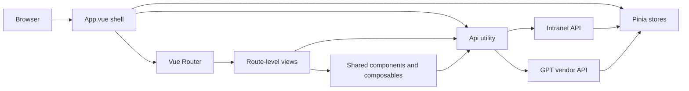
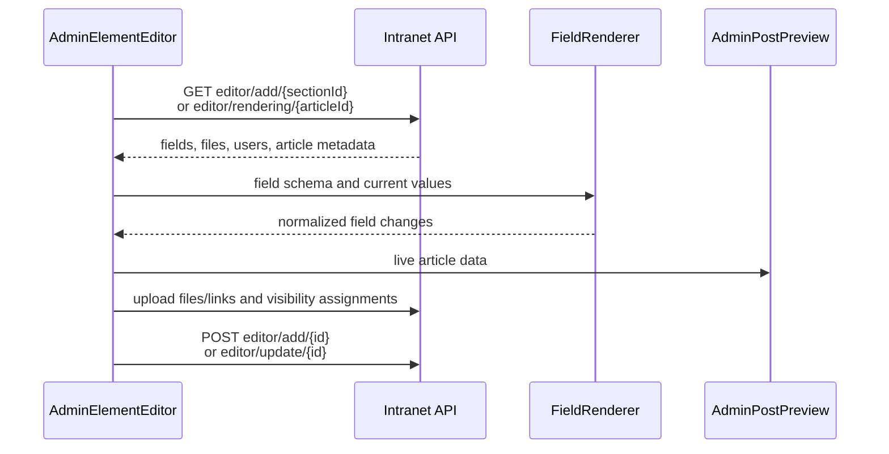

# Architecture

## Runtime overview

The application is a client-rendered Vue 3 SPA. Route components are lazy-loaded,
while the shell, session restoration, shared navigation, and global UI services
are initialized at startup.



The main entry point, `src/main.ts`, installs:

- the router and Pinia;
- PrimeVue and its toast service;
- global `VueDatePicker` and `FileUpload` components;
- the `v-lazy-load` directive;
- Bootstrap CSS/JavaScript and the global SCSS bundle.

## Application shell

`src/App.vue` chooses one of three layouts:

1. `vcard` renders the public-style virtual card view without the standard shell.
2. `inservice` renders the maintenance page.
3. Every other route is wrapped in pull-to-refresh and, once authenticated,
   receives the header, breadcrumbs, route content, sidebar, and scroll control.

If no session can be restored, the shell shows `AuthPage`. The shell also owns
the global PrimeVue toast and Yandex Metrika integration.

After login it prefetches user, calendar, and points data. Blog and factory-guide
data are loaded only when a matching route is visited. The GPT service quota is
queried independently from `https://gpt.emk.ru`.

## Authentication and authorization

### Session restoration

The backend session identifier is stored in the `session_id` browser cookie.
Before mount, `App.vue` reads that cookie and calls:

```text
GET users/find_by_session_id/{session_id}
```

The response is used as the current user ID. The user store then keeps the
session ID, user ID, profile, permissions, notifications, and login state.

The primary Axios client sends both browser credentials and a `session_id`
request header. Vendor requests additionally send `user_id`.

### Login modes

- Development (`import.meta.env.DEV`): `AuthPage` submits `VITE_LOGIN` and
  `VITE_PASSWORD` to `auth_router/root_auth`.
- Production: `AuthPage` redirects through the OAuth route assembled from
  `VITE_OAUTH_DOMEN` and `VITE_OAUTH_CLIENT_ID`.

The current route is saved in a `referrer` cookie before authentication so the
surrounding authentication system can return the user to the intended page.

### Roles

The frontend fetches role data from `roots/get_root_token_by_uuid`. The user
store recognizes these role fields:

| Role field       | Frontend use                                     |
| ---------------- | ------------------------------------------------ |
| `EditorAdmin`    | Full editor administration and GPT access        |
| `EditorModer`    | Editing rights for selected content sections     |
| `PeerAdmin`      | Points administration and notification broadcast |
| `PeerModer`      | Points moderation access                         |
| `peerCurator`    | Curator access in the points system              |
| `VisionAdmin`    | Visibility-area administration                   |
| `VisionRoots`    | Assigned visibility scopes                       |
| `GPT_gen_access` | AI image-generation access                       |

Administrative route guards verify that the permissions endpoint returns a
non-empty object. Individual pages and sidebar groups apply additional role and
feature-flag checks. These client checks improve navigation and UX; the backend
must still enforce authorization for every protected endpoint.

## Routing

`src/router/index.ts` contains a flat named-route table and uses
`createWebHistory`. Most route components are dynamic imports. Breadcrumbs are
declared in route metadata and consumed by the shared breadcrumb component.

Because history mode is enabled, a production server must return `index.html`
for direct requests to frontend paths such as `/news/actual/123`.

`src/router/uniqueRoutesHandle.ts` centralizes parameter construction for cards
whose targets need more than a simple `id`, such as factory tours, experience
sectors, and official events.

See [Routes and features](routes-and-features.md) for the route inventory.

## State management

Pinia stores are intentionally small and domain-specific.

| Store                  | Responsibility                                                      |
| ---------------------- | ------------------------------------------------------------------- |
| `userData`             | Session, current profile, permissions, notifications, and GPT quota |
| `viewsData`            | Cached lists for home, news, media, events, and calendar views      |
| `userScoreData`        | Current balance, available actions, and points history              |
| `pointsData`           | Points-system activity definitions                                  |
| `blogData`             | Blog authors and articles                                           |
| `factoryGuid`          | Factories, reports, and virtual tours                               |
| `referencesAndExpData` | Factories, sectors, and supply-reference documents                  |
| `adminData`            | Editable content sections returned by the backend                   |
| `styleMode`            | Dark-mode state                                                     |
| `pageData`             | Current-route bookkeeping                                           |

Stores are in-memory only. A page reload reconstructs state from the session
cookie and API calls; no Pinia persistence plugin is used.

## API layer

`src/utils/Api.ts` exposes static `get`, `post`, `put`, and `delete` methods over
an Axios instance whose base URL is `VITE_API_URL`. It also exposes `getVendor`
and `postVendor` for absolute third-party/service URLs.

Central behavior:

- `withCredentials` is enabled for both clients;
- `session_id` is added to all requests;
- vendor requests also receive `user_id`;
- primary API `401` responses clear the user store and browser cookies;
- primary API `502` responses redirect to the maintenance page;
- `GET` supports `AbortSignal` for cancellation;
- `POST` can return the full Axios response when a config object is supplied,
  which is used for blobs and upload progress.

One important consequence is that `get` and `post` handle some errors internally
and may resolve to `undefined` instead of rejecting. Callers should validate the
returned value before reading it. `put`, `delete`, and vendor calls do not share
that error handling and can reject normally.

### Content endpoints

Most editorial content uses a common article model:

```text
GET article/find_by/{sectionId}
GET article/find_by/{sectionId}?offset=0&limit=15&year=2026&tag=4
GET article/find_by_ID/{articleId}
PUT article/add_or_remove_like/{articleId}
```

Human-readable section names are mapped to backend numeric IDs in
`src/assets/static/sectionTips.ts`. That mapping is a contract with the backend;
changing an ID changes the content returned by the associated page.

`LayoutPostsPreview.vue` provides the standard paginated list implementation.
It loads 15 records at a time, stores the first page in `viewsData`, and supports
year and tag filters. `PostInner.vue` is the shared article-detail renderer.

## Schema-driven administration

The editor UI is driven by field metadata returned by the backend rather than a
separate hard-coded form for every content section.



The field renderer selects controls from each field's `data_type` and `field`
name. It has special handling for users, departments, tags, visibility areas,
reportage links, images, documents, native video, and embedded video.

The editor section list comes from `editor/get_sections_list`. Static
administrative groups—notifications, visibility, points, and rights—are merged
with that response in `AdminSidebar.vue`.

## Feature flags

`src/assets/static/featureFlags.ts` contains frontend constants for notification
broadcast, the points system, points moderation, visibility areas, the new-worker
memo, pagination, and transactions.

These are build-time source flags, not remote configuration. Changing one
requires rebuilding and redeploying the frontend. Flags hide or redirect UI;
they are not a substitute for backend access control.

## Styling and assets

Global styles enter through `src/assets/styles/_main.scss`. Shared variables,
mixins, layout styles, feature classes, admin styles, gallery styles, and module
styles are split into partials below that directory. Vite injects the mixins file
into every SCSS compilation unit.

- Use `src/assets/` for resources imported by TypeScript, Vue, or SCSS.
- Use `public/` for resources addressed by stable root-relative URLs.
- SVG imports can use `?component` through `vite-svg-loader`.
- The bundled Onest font family lives in `src/assets/fonts/`.

## HTML content

The codebase includes utilities for Markdown rendering and allow-list HTML
sanitization. Some article content is also rendered directly with `v-html` after
being returned by the backend. Content supplied to those fields must therefore
be sanitized by a trusted boundary before rendering.
